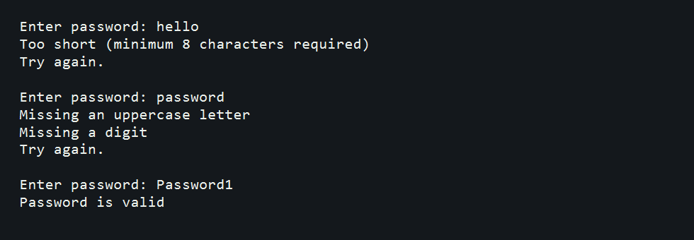

# SafeLog Password Validator

## Overview

This Java mini project validates passwords using simple security rules. It checks minimum length, presence of uppercase letters, and presence of digits.

## Features

- Validates password length
- Checks for at least one uppercase letter
- Checks for at least one digit
- Re-prompts until the password is valid

## Java Concepts Used

- Classes and methods
- Loops
- Conditional statements
- Character utility methods
- User input with `Scanner`

## Screenshot

## Author

Suru Harshit
